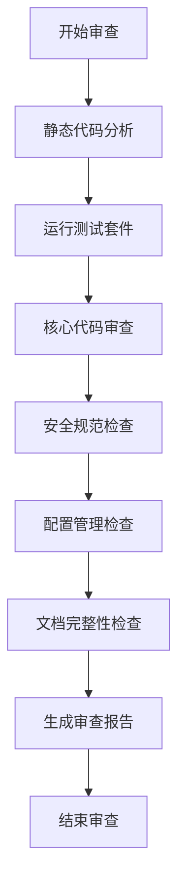

# CONSENSUS - 项目审查

## 一、需求描述

对工作区内的两个核心项目 `lz-agent` 和 `openhuman` 进行全面项目审查。审查目标包括：

1. **架构设计评估**：评估系统架构的合理性、模块划分的清晰度、依赖关系的合理性
2. **代码质量评估**：检查代码规范、可读性、复杂度、错误处理
3. **测试覆盖评估**：评估单元测试、集成测试的覆盖范围和质量
4. **安全规范评估**：检查配置管理、API 密钥保护、权限控制、输入验证
5. **配置管理评估**：评估配置文件的完整性、环境变量管理、敏感信息处理
6. **文档完整性评估**：检查项目文档、API 文档、代码注释的完整性

## 二、验收标准

### 2.1 审查报告完整性

| 验收项 | 标准 |
|--------|------|
| 架构评估 | 每个项目至少输出 5 个架构层面的观察和建议 |
| 代码质量 | 每个项目至少输出 10 个代码质量问题或改进点 |
| 测试评估 | 每个项目至少输出 5 个测试相关的建议 |
| 安全审查 | 每个项目至少输出 3 个安全相关的问题或改进建议 |
| 配置管理 | 每个项目至少输出 3 个配置管理相关的建议 |
| 文档评估 | 每个项目至少输出 3 个文档相关的建议 |

### 2.2 问题分类标准

| 严重程度 | 定义 | 示例 |
|----------|------|------|
| **Critical** | 安全漏洞、架构缺陷、会导致系统崩溃或数据丢失的问题 | SQL 注入风险、未授权访问、硬编码密钥 |
| **High** | 严重的代码质量问题、测试缺失、会导致功能异常的问题 | 未处理异常、关键功能无测试、配置错误 |
| **Medium** | 中等程度的改进机会、代码风格问题、文档缺失 | 代码重复、命名不规范、缺少注释 |
| **Low** | 轻微的改进机会、优化建议 | 性能优化、代码组织、文档优化 |

### 2.3 审查范围确认

#### lz-agent 审查范围

| 模块 | 审查内容 |
|------|----------|
| `src/agent/` | Agent 核心逻辑、工具调用循环、协议实现 |
| `src/tools/` | 工具系统、权限控制、命令白名单 |
| `src/memory/` | 记忆系统、数据持久化、SQLite 操作 |
| `src/rag/` | RAG 模块、向量化、检索逻辑 |
| `src/mcp/` | MCP 协议实现、API 暴露 |
| `src/config.py` | 配置管理、环境变量处理 |
| `entry/` | 入口层、CLI 和 MCP 服务器 |
| `tests/` | 测试覆盖、测试质量 |
| `scripts/` | 启动脚本、质量检查脚本 |
| `.env.example` | 配置模板完整性 |

#### openhuman 审查范围

| 模块 | 审查内容 |
|------|----------|
| `src/api/` | API 层、REST/RPC 接口定义 |
| `src/core/` | 核心系统服务、CLI、运行时 |
| `src/openhuman/` | 业务域逻辑、agent、memory、tools |
| `src/rpc/` | RPC 层、JSON-RPC 实现 |
| `app/src/` | React 前端、组件结构 |
| `tests/` | 集成测试、测试质量 |
| `scripts/` | 启动脚本、构建脚本 |
| `.env.example` | 配置模板完整性 |

### 2.4 审查方法

1. **静态代码分析**：使用项目自带的代码质量工具（flake8, mypy, clippy）
2. **代码审查**：人工审查核心模块的代码结构和实现
3. **测试执行**：运行单元测试验证核心功能
4. **配置检查**：审查配置文件和环境变量管理
5. **安全扫描**：检查敏感信息处理、权限控制

## 三、技术实现方案

### 3.1 审查工具链

| 工具 | 用途 | 命令 |
|------|------|------|
| flake8 | Python 代码规范检查 | `flake8 src/ tests/` |
| mypy | Python 类型检查 | `mypy src/` |
| pytest | Python 测试执行 | `python3 -m pytest` |
| cargo check | Rust 编译检查 | `cargo check` |
| cargo clippy | Rust 代码质量检查 | `cargo clippy` |
| cargo test | Rust 测试执行 | `cargo test` |
| vitest | TypeScript 测试执行 | `pnpm test` |
| rustfmt | Rust 代码格式化 | `cargo fmt` |

### 3.2 审查流程

### 3.3 技术约束

1. **模型服务**：模型文件存储在 `/media/lz/bf/model/`，审查期间可能需要启动模型服务进行集成测试
2. **环境依赖**：openhuman 需要 Rust 1.93.0、Node.js 24+、pnpm 10.10.0
3. **网络访问**：某些测试可能需要网络访问（如 Web 搜索工具测试）

## 四、任务边界限制

### 4.1 包含的工作

- 对 lz-agent 和 openhuman 两个项目的核心模块进行全面审查
- 运行项目自带的测试套件验证功能正确性
- 使用代码质量工具进行静态分析
- 生成结构化审查报告，包含问题清单和改进建议
- 提供模型启动命令和服务启动命令汇总

### 4.2 不包含的工作

- 修改代码实现修复问题（除非用户明确要求）
- 性能分析和优化（除非用户明确要求）
- 集成测试（需要模型服务运行）
- 第三方依赖库的审查（如 sglang、tinyagents 等）
- 前端界面的详细审查（重点关注后端逻辑）

### 4.3 审查产出物

1. **CONSENSUS 文档**：明确审查范围和验收标准（本文件）
2. **DESIGN 文档**：审查架构设计和模块分析
3. **TASK 文档**：拆分的原子审查任务
4. **ACCEPTANCE 文档**：审查执行记录和完成情况
5. **FINAL 报告**：综合审查报告，包含问题清单和改进建议

## 五、风险与假设

### 5.1 风险

| 风险 | 影响 | 缓解措施 |
|------|------|----------|
| 模型服务未启动 | 集成测试无法执行 | 提前通知用户启动模型服务 |
| 测试环境不完整 | 部分测试可能失败 | 只运行核心单元测试 |
| 代码量过大 | 审查时间过长 | 重点审查核心模块 |
| 环境依赖缺失 | 构建或测试失败 | 使用项目已有的环境配置 |

### 5.2 假设

| 假设 | 说明 |
|------|------|
| 项目已正确构建 | openhuman 已编译，lz-agent 已安装依赖 |
| 模型文件存在 | `/media/lz/bf/model/` 目录下存在所需模型文件 |
| 环境变量已配置 | `.env` 文件已正确配置 |
| 网络可访问 | 基础网络访问可用（用于部分测试） |

---

**文档版本**: v1.0  
**创建时间**: 2026-07-17  
**适用项目**: lz-agent, openhuman