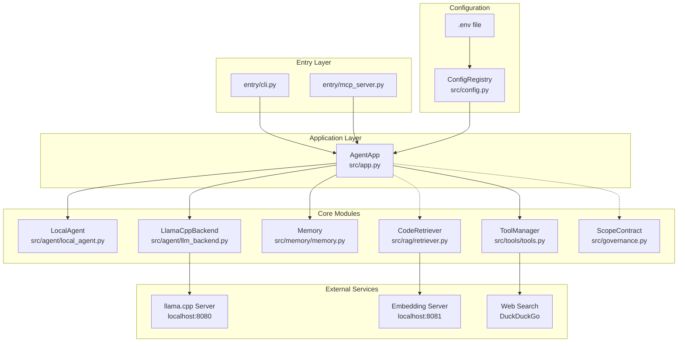
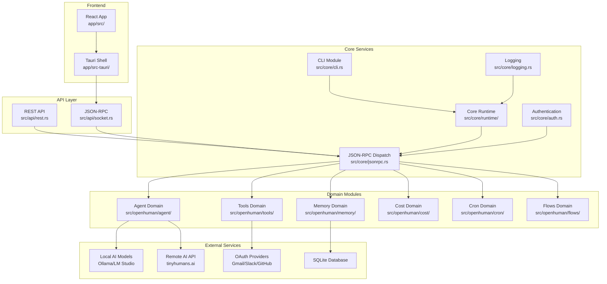
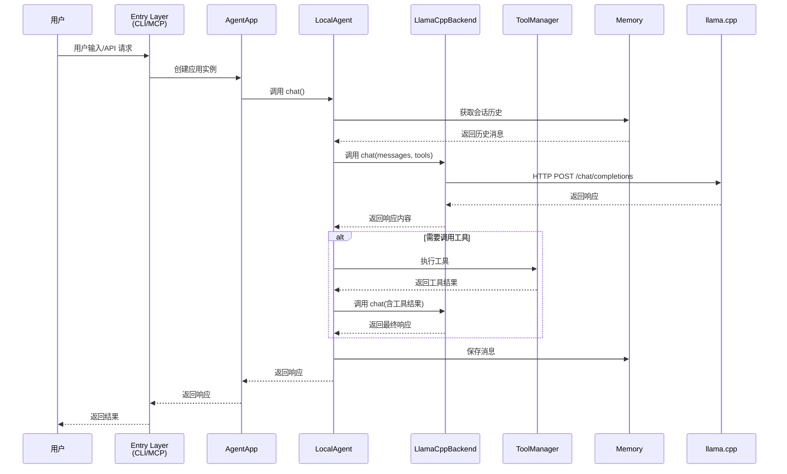
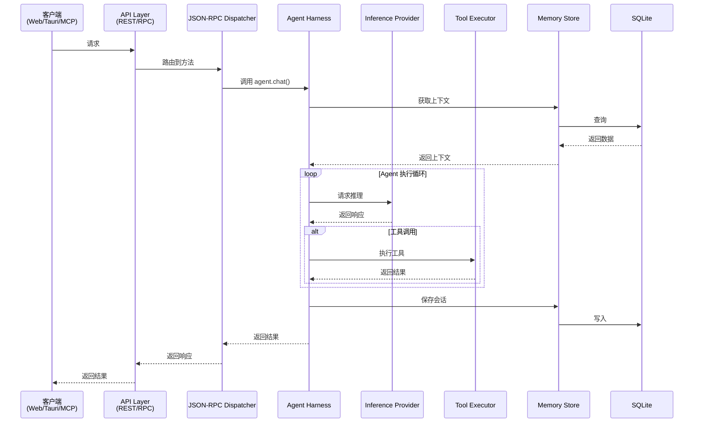
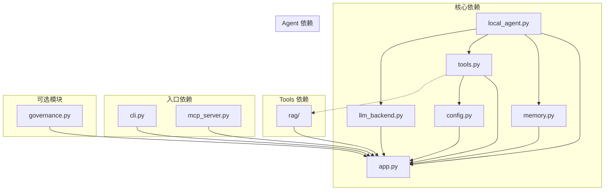
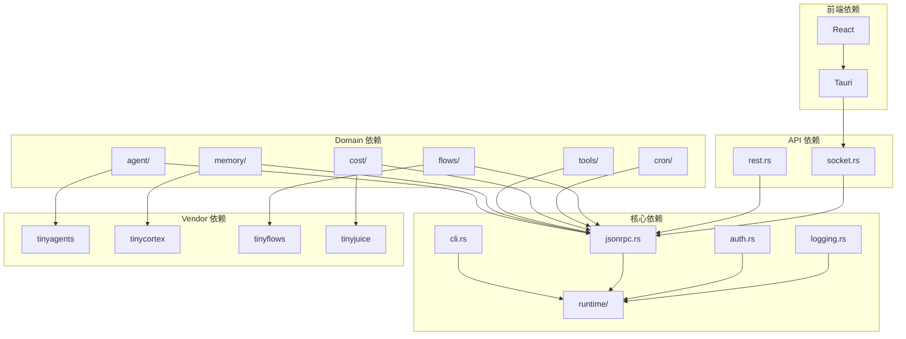

# DESIGN - 项目审查架构设计

## 一、整体架构图

### 1.1 lz-agent 架构



### 1.2 openhuman 架构



## 二、分层设计

### 2.1 lz-agent 分层

| 层级 | 模块 | 职责 |
|------|------|------|
| **入口层** | `entry/` | CLI 和 MCP 服务器入口，接收外部请求 |
| **应用层** | `src/app.py` | 应用工厂，组装所有依赖组件 |
| **Agent 层** | `src/agent/` | Agent 核心逻辑，工具调用循环，协议实现 |
| **工具层** | `src/tools/` | 工具系统，权限控制，命令白名单 |
| **记忆层** | `src/memory/` | 记忆系统，数据持久化，SQLite 操作 |
| **LLM 层** | `src/agent/llm_backend.py` | LLM 推理后端，统一封装不同推理方式 |
| **RAG 层** | `src/rag/` | RAG 模块，向量化，检索逻辑 |
| **配置层** | `src/config.py` | 配置管理，环境变量处理 |
| **治理层** | `src/governance.py` | 范围契约，权限控制，验收命令 |

### 2.2 openhuman 分层

| 层级 | 模块 | 职责 |
|------|------|------|
| **前端层** | `app/src/` | React 前端，用户界面，状态管理 |
| **Tauri 层** | `app/src-tauri/` | Tauri 桌面框架，系统集成 |
| **API 层** | `src/api/` | REST 和 WebSocket API，请求路由 |
| **RPC 层** | `src/rpc/` | JSON-RPC 协议，方法调用 |
| **核心服务层** | `src/core/` | CLI，运行时，认证，日志，调度 |
| **业务域层** | `src/openhuman/` | agent, memory, tools, cost, cron, flows 等 |
| **外部集成层** | vendor 依赖 | tinyagents, tinycortex, tinyflows 等 |

## 三、核心组件

### 3.1 lz-agent 核心组件

#### AgentApp (应用工厂)
- **文件**: `src/app.py`
- **职责**: 组装所有依赖组件，提供统一入口
- **依赖注入**: 通过构造函数注入所有模块
- **特性**: 支持可选的 RAG 和 Governance 模块

#### LocalAgent (本地 Agent)
- **文件**: `src/agent/local_agent.py`
- **职责**: 实现 Agent 核心逻辑，工具调用循环
- **特性**: 
  - 支持多种工具调用格式（JSON、OpenAI format）
  - 会话历史管理
  - 范围契约支持

#### ToolManager (工具管理器)
- **文件**: `src/tools/tools.py`
- **职责**: 工具注册、发现、执行和权限控制
- **特性**:
  - 命令白名单机制
  - 路径安全检查
  - 输出验证

#### LlamaCppBackend (LLM 后端)
- **文件**: `src/agent/llm_backend.py`
- **职责**: 封装 llama.cpp HTTP API 调用
- **特性**:
  - 支持 completions 和 chat/completions 端点
  - 工具调用格式转换
  - 异常处理

#### Memory (记忆系统)
- **文件**: `src/memory/memory.py`
- **职责**: SQLite 持久化记忆系统
- **特性**:
  - 会话历史存储
  - 长期记忆管理
  - 统计查询

### 3.2 openhuman 核心组件

#### CoreBuilder / CoreRuntime (运行时)
- **文件**: `src/core/runtime/`
- **职责**: 构建和管理核心运行时，可嵌入任何进程
- **特性**:
  - 支持 Tauri shell、CLI、MCP server、云服务器
  - 模块化服务注册

#### Agent Domain (Agent 域)
- **文件**: `src/openhuman/agent/`
- **职责**: 多 Agent 编排、工具执行、会话管理
- **核心组件**:
  - `harness::session::Agent`: 对话入口
  - `dispatcher`: 工具调用格式化策略
  - `triage`: 触发器分类管道

#### CLI Module (命令行界面)
- **文件**: `src/core/cli.rs`
- **职责**: 参数解析、子命令分发、帮助信息
- **特性**:
  - 支持 run/serve、mcp、call 等子命令
  - 自动补全支持
  - 命名空间命令分发

#### API Layer (API 层)
- **文件**: `src/api/`
- **职责**: 外部接口定义，REST 和 WebSocket
- **特性**:
  - 认证处理
  - Socket.IO 桥接
  - JSON-RPC 端点

## 四、接口契约定义

### 4.1 lz-agent 接口

#### MCP 接口
| 端点 | 方法 | 描述 |
|------|------|------|
| `/tools` | GET | 获取工具列表 |
| `/execute` | POST | 执行工具调用 |
| `/sse` | GET | SSE 连接端点 |

#### 工具接口 (ToolManager)
```python
# 工具注册
def register_tool(name, description, parameters, handler)

# 工具列表
def list_tools() -> List[Dict]

# 工具执行
def execute(name, **kwargs) -> str
```

#### Agent 接口 (LocalAgent)
```python
# 聊天接口
def chat(message: str, session_id: str = "default") -> str

# 重置会话
def reset(session_id: str = "default") -> None

# 获取工具列表
@property
def tools() -> list
```

#### LLM 后端接口 (LLMBackend)
```python
# 文本生成
def generate(prompt: str, **kwargs) -> str

# 聊天接口
def chat(messages: List[Dict], **kwargs) -> str
```

### 4.2 openhuman 接口

#### CLI 命令
| 命令 | 描述 |
|------|------|
| `openhuman run` | 启动核心 HTTP/JSON-RPC 服务器 |
| `openhuman serve` | 同上 |
| `openhuman mcp` | 启动 stdio MCP 服务器 |
| `openhuman call` | 直接调用 JSON-RPC 方法 |
| `openhuman agent` | Agent 子命令 |
| `openhuman memory` | 记忆子命令 |
| `openhuman subconscious` | 潜意识子命令 |

#### JSON-RPC 命名空间
| 命名空间 | 描述 |
|----------|------|
| `agent` | Agent 相关操作 |
| `memory` | 记忆相关操作 |
| `tools` | 工具相关操作 |
| `cost` | 成本相关操作 |
| `cron` | 定时任务相关操作 |
| `flows` | 工作流相关操作 |

## 五、数据流向图

### 5.1 lz-agent 数据流向



### 5.2 openhuman 数据流向



## 六、异常处理策略

### 6.1 lz-agent 异常处理

| 异常类型 | 处理策略 |
|----------|----------|
| `LLMError` | LLM 推理失败，向上抛出 |
| `LLMConnectionError` | 连接失败，向上抛出 |
| `LLMTimeoutError` | 请求超时，向上抛出 |
| `ToolError` | 工具执行失败，返回错误消息 |
| `ToolNotFoundError` | 工具不存在，返回错误消息 |
| `ToolPermissionError` | 权限不足，返回错误消息 |
| `ToolValidationError` | 参数验证失败，返回错误消息 |
| `MemoryError` | 记忆系统错误，向上抛出 |

### 6.2 openhuman 异常处理

| 异常类型 | 处理策略 |
|----------|----------|
| `anyhow::Error` | 通用错误，返回 JSON-RPC 错误 |
| `serde_json::Error` | JSON 解析错误，返回客户端错误 |
| `reqwest::Error` | HTTP 请求错误，重试或返回错误 |
| `rusqlite::Error` | 数据库错误，返回错误 |
| `sentry::Event` | 错误上报到 Sentry |
| 瞬态错误 | 自动重试，指数退避 |

## 七、模块依赖关系图

### 7.1 lz-agent 依赖关系



### 7.2 openhuman 依赖关系



---

**文档版本**: v1.0  
**创建时间**: 2026-07-17  
**适用项目**: lz-agent, openhuman