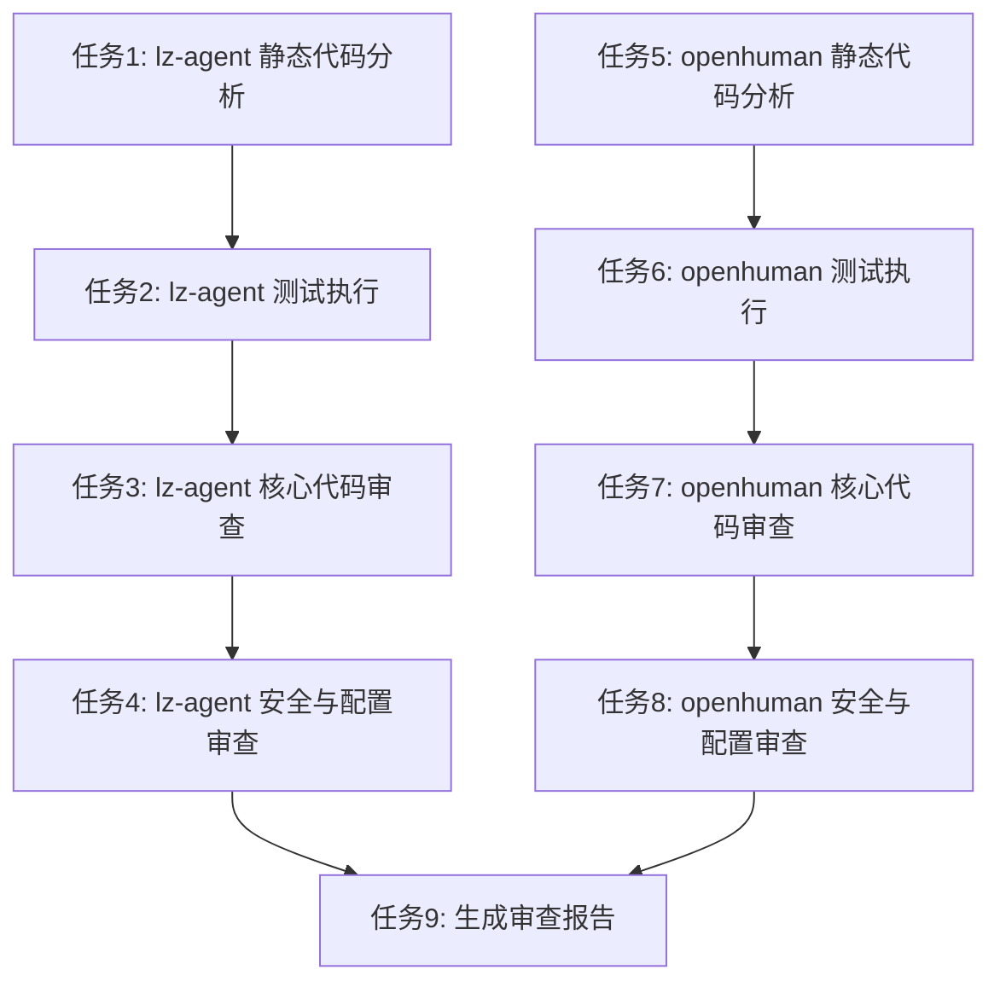

# TASK - 项目审查任务拆分

## 一、任务依赖关系图

## 二、原子任务定义

### 任务1: lz-agent 静态代码分析

| 属性 | 值 |
|------|------|
| **任务ID** | T001 |
| **优先级** | 高 |
| **状态** | 待执行 |

#### 输入契约
- 前置依赖：无
- 输入数据：lz-agent 源代码 (`src/`, `tests/`, `entry/`)
- 环境依赖：Python 3.12, flake8, mypy

#### 输出契约
- 输出数据：flake8 检查报告、mypy 检查报告
- 交付物：静态分析结果总结
- 验收标准：执行 `bash scripts/check_quality.sh` 无错误

#### 实现约束
- 技术栈：Python
- 接口规范：使用项目自带的质量检查脚本

#### 依赖关系
- 前置任务：无
- 后置任务：T002

---

### 任务2: lz-agent 测试执行

| 属性 | 值 |
|------|------|
| **任务ID** | T002 |
| **优先级** | 高 |
| **状态** | 待执行 |

#### 输入契约
- 前置依赖：T001 完成
- 输入数据：lz-agent 测试代码 (`tests/`)
- 环境依赖：Python 3.12, pytest

#### 输出契约
- 输出数据：pytest 测试报告、覆盖率报告
- 交付物：测试执行结果总结
- 验收标准：核心单元测试通过

#### 实现约束
- 技术栈：Python, pytest
- 接口规范：使用项目自带的测试配置

#### 依赖关系
- 前置任务：T001
- 后置任务：T003

---

### 任务3: lz-agent 核心代码审查

| 属性 | 值 |
|------|------|
| **任务ID** | T003 |
| **优先级** | 高 |
| **状态** | 待执行 |

#### 输入契约
- 前置依赖：T002 完成
- 输入数据：lz-agent 核心模块源代码
- 环境依赖：无

#### 输出契约
- 输出数据：代码审查结果（架构评估、代码质量、文档完整性）
- 交付物：核心代码审查报告
- 验收标准：至少输出 10 个代码质量问题或改进点

#### 实现约束
- 技术栈：Python
- 接口规范：按模块逐一审查

#### 依赖关系
- 前置任务：T002
- 后置任务：T004

---

### 任务4: lz-agent 安全与配置审查

| 属性 | 值 |
|------|------|
| **任务ID** | T004 |
| **优先级** | 高 |
| **状态** | 待执行 |

#### 输入契约
- 前置依赖：T003 完成
- 输入数据：lz-agent 配置文件、启动脚本、安全相关代码
- 环境依赖：无

#### 输出契约
- 输出数据：安全审查结果（配置管理、API 密钥保护、权限控制）
- 交付物：安全与配置审查报告
- 验收标准：至少输出 3 个安全相关问题或改进建议

#### 实现约束
- 技术栈：Python
- 接口规范：按安全最佳实践审查

#### 依赖关系
- 前置任务：T003
- 后置任务：T009

---

### 任务5: openhuman 静态代码分析

| 属性 | 值 |
|------|------|
| **任务ID** | T005 |
| **优先级** | 高 |
| **状态** | 待执行 |

#### 输入契约
- 前置依赖：无
- 输入数据：openhuman 源代码 (`src/`)
- 环境依赖：Rust 1.93.0, cargo clippy

#### 输出契约
- 输出数据：cargo check 结果、cargo clippy 检查报告
- 交付物：静态分析结果总结
- 验收标准：`cargo check` 通过，`cargo clippy` 无警告

#### 实现约束
- 技术栈：Rust
- 接口规范：使用 Rust 官方工具链

#### 依赖关系
- 前置任务：无
- 后置任务：T006

---

### 任务6: openhuman 测试执行

| 属性 | 值 |
|------|------|
| **任务ID** | T006 |
| **优先级** | 高 |
| **状态** | 待执行 |

#### 输入契约
- 前置依赖：T005 完成
- 输入数据：openhuman 测试代码 (`tests/`)
- 环境依赖：Rust 1.93.0, cargo test

#### 输出契约
- 输出数据：cargo test 测试报告
- 交付物：测试执行结果总结
- 验收标准：核心单元测试通过

#### 实现约束
- 技术栈：Rust
- 接口规范：使用项目自带的测试配置

#### 依赖关系
- 前置任务：T005
- 后置任务：T007

---

### 任务7: openhuman 核心代码审查

| 属性 | 值 |
|------|------|
| **任务ID** | T007 |
| **优先级** | 高 |
| **状态** | 待执行 |

#### 输入契约
- 前置依赖：T006 完成
- 输入数据：openhuman 核心模块源代码
- 环境依赖：无

#### 输出契约
- 输出数据：代码审查结果（架构评估、代码质量、文档完整性）
- 交付物：核心代码审查报告
- 验收标准：至少输出 10 个代码质量问题或改进点

#### 实现约束
- 技术栈：Rust
- 接口规范：按模块逐一审查

#### 依赖关系
- 前置任务：T006
- 后置任务：T008

---

### 任务8: openhuman 安全与配置审查

| 属性 | 值 |
|------|------|
| **任务ID** | T008 |
| **优先级** | 高 |
| **状态** | 待执行 |

#### 输入契约
- 前置依赖：T007 完成
- 输入数据：openhuman 配置文件、启动脚本、安全相关代码
- 环境依赖：无

#### 输出契约
- 输出数据：安全审查结果（配置管理、API 密钥保护、权限控制）
- 交付物：安全与配置审查报告
- 验收标准：至少输出 3 个安全相关问题或改进建议

#### 实现约束
- 技术栈：Rust
- 接口规范：按安全最佳实践审查

#### 依赖关系
- 前置任务：T007
- 后置任务：T009

---

### 任务9: 生成审查报告

| 属性 | 值 |
|------|------|
| **任务ID** | T009 |
| **优先级** | 高 |
| **状态** | 待执行 |

#### 输入契约
- 前置依赖：T004 和 T008 完成
- 输入数据：所有审查任务的输出结果
- 环境依赖：无

#### 输出契约
- 输出数据：综合审查报告（问题清单、改进建议、风险评估）
- 交付物：FINAL_项目审查.md、ACCEPTANCE_项目审查.md
- 验收标准：报告完整、问题分类清晰、建议可操作

#### 实现约束
- 技术栈：Markdown
- 接口规范：按 CONSENSUS 文档定义的格式输出

#### 依赖关系
- 前置任务：T004, T008
- 后置任务：无

## 三、任务执行顺序

| 顺序 | 任务ID | 任务名称 | 预计耗时 |
|------|--------|----------|----------|
| 1 | T001 | lz-agent 静态代码分析 | 10 分钟 |
| 2 | T002 | lz-agent 测试执行 | 30 分钟 |
| 3 | T003 | lz-agent 核心代码审查 | 45 分钟 |
| 4 | T004 | lz-agent 安全与配置审查 | 20 分钟 |
| 5 | T005 | openhuman 静态代码分析 | 15 分钟 |
| 6 | T006 | openhuman 测试执行 | 45 分钟 |
| 7 | T007 | openhuman 核心代码审查 | 60 分钟 |
| 8 | T008 | openhuman 安全与配置审查 | 25 分钟 |
| 9 | T009 | 生成审查报告 | 30 分钟 |

## 四、任务验收检查清单

### T001: lz-agent 静态代码分析
- [ ] flake8 检查通过（无错误）
- [ ] mypy 检查通过（无类型错误）
- [ ] 检查结果已记录

### T002: lz-agent 测试执行
- [ ] pytest 单元测试通过
- [ ] 测试覆盖率报告已生成
- [ ] 测试结果已记录

### T003: lz-agent 核心代码审查
- [ ] 架构评估完成（至少 5 个观察）
- [ ] 代码质量评估完成（至少 10 个改进点）
- [ ] 文档完整性评估完成（至少 3 个建议）

### T004: lz-agent 安全与配置审查
- [ ] 安全审查完成（至少 3 个问题/建议）
- [ ] 配置管理审查完成（至少 3 个建议）
- [ ] 测试覆盖评估完成（至少 5 个建议）

### T005: openhuman 静态代码分析
- [ ] cargo check 通过
- [ ] cargo clippy 检查通过（无警告）
- [ ] 检查结果已记录

### T006: openhuman 测试执行
- [ ] cargo test 单元测试通过
- [ ] 测试结果已记录

### T007: openhuman 核心代码审查
- [ ] 架构评估完成（至少 5 个观察）
- [ ] 代码质量评估完成（至少 10 个改进点）
- [ ] 文档完整性评估完成（至少 3 个建议）

### T008: openhuman 安全与配置审查
- [ ] 安全审查完成（至少 3 个问题/建议）
- [ ] 配置管理审查完成（至少 3 个建议）
- [ ] 测试覆盖评估完成（至少 5 个建议）

### T009: 生成审查报告
- [ ] ACCEPTANCE 文档已更新
- [ ] FINAL 报告已生成
- [ ] 问题清单已整理
- [ ] 改进建议已生成

---

**文档版本**: v1.0  
**创建时间**: 2026-07-17  
**适用项目**: lz-agent, openhuman